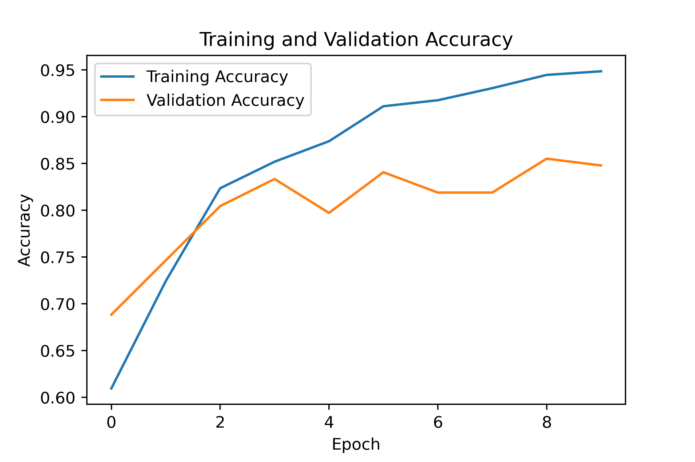
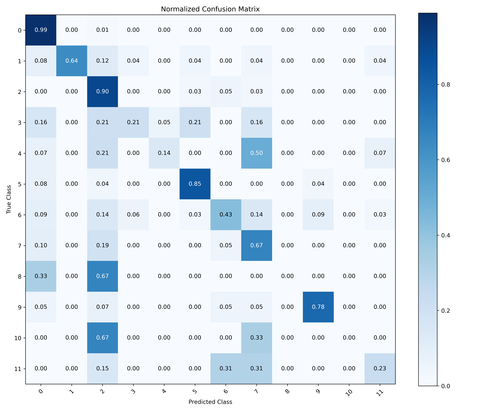

# Deep Neural Network Implementation for Ransomware Family Classification

**Author:** Leo Martinez III - [LinkedIn](https://www.linkedin.com/in/leo-martinez-iii/)

**Contact:** [leo.martinez@students.tamuk.edu](mailto:leo.martinez@students.tamuk.edu)

**Created:** Summer 2024

To close this repository:

```
git clone https://github.com/LeoMartinezTAMUK/Ransomware_Family_Classification_ML.git

```

---

This Python program implements a Deep Neural Network (DNN) for classifying ransomware families using the Ransomware RISS Dataset. The dataset provides various features to analyze ransomware and classify it into different families.

### Model Overview:

- **Language**: Python 3.18
- **IDE**: Spyder
- **Libraries Used**:
  - `numpy`
  - `pandas`
  - `matplotlib`
  - `seaborn`
  - `sklearn`
  - `keras`

### Dataset:

The dataset used for this project is the Ransomware RISS Dataset, which is accessible [here](https://rissgroup.org/ransomware-dataset/). Due to its size, it is not included in this repository.

### Implementation Details:

- **Data Loading**: The dataset is loaded from a CSV file.
- **Data Splitting**: The data is split into features (`X`) and target labels (`y`) for training and testing, with a 60/40 split.
- **Model Architecture**:
  - **Input Layer**: Takes 30,967 binary features.
  - **Hidden Layers**:
    - 1st Layer: 256 neurons, ReLU activation
    - 2nd Layer: 128 neurons, ReLU activation
    - 3rd Layer: 64 neurons, ReLU activation
    - 4th Layer: 32 neurons, ReLU activation
  - **Output Layer**: 12 neurons (for 12 classes), Softmax activation

### Training:

The model is compiled with the Adam optimizer and sparse categorical cross-entropy loss function. It is trained for 10 epochs with a batch size of 16. Early stopping is used with a patience of 6 to prevent overfitting.

### Evaluation:

The model's performance is evaluated using the classification report, confusion matrix, and Matthews correlation coefficient (MCC). A confusion matrix heatmap is generated to visualize the results.

### Visualization:

The training and validation accuracy are plotted and saved as `training_validation_accuracy_plot.png`. The confusion matrix heatmap is saved as `Heatmap_400dpi.png`.



### Note:

- This project was created in Spyder, and separators ('#%%') are used for code sectioning.
- For further details and similar projects, please visit my [GitHub Page](https://github.com/LeoMartinezTAMUK).

Here is a brief explanation of the items:
- **src:** folder that contains the source code python script (.py)
- **images:** contains the generated DNN training graph and confusion matrix heatmap (dataset is provided as a link due to size)
- **dataset_info:** provides more context regarding the dataset from the original authors of the dataset
- **README.md:** contains most basic information about the project
- **LICENSE:** Contains license information in regards to the Github repository

